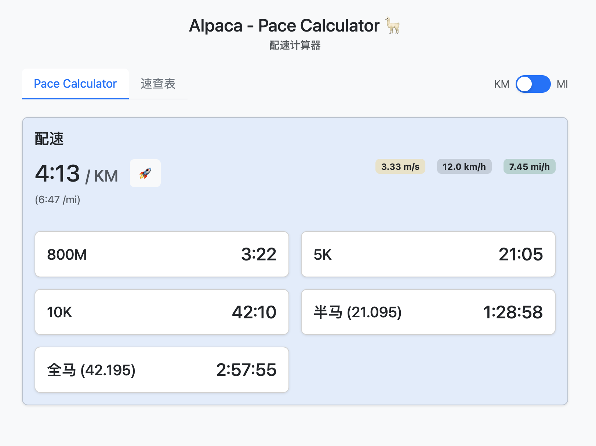
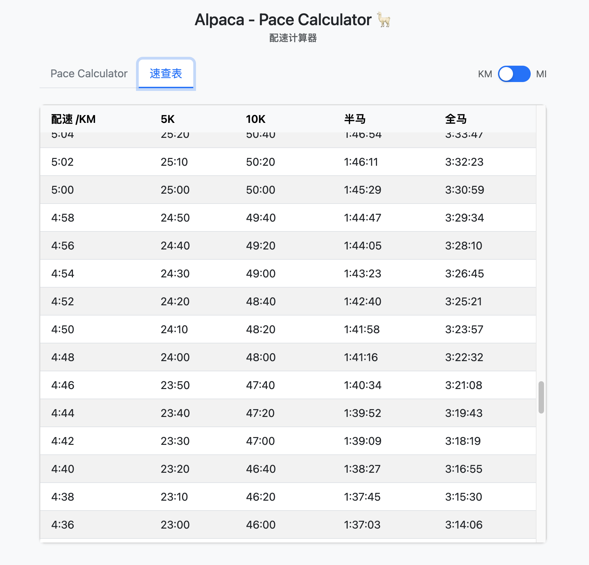

LanternD 前言：程序的大部分代码由 Cursor（Claude 3.5 Sonnet）生成。我负责定义功能、UI 设计、业务逻辑等。除了这一行，剩下的 Readme 也是由Cursor生成的。

# Alpaca - Pace Calculator 🦙

一个简单易用的跑步配速计算器，帮助跑者快速计算不同距离的完成时间。

## 界面预览

### 配速计算器

### 速查表

## 主要特性

### 1. 配速计算
- 支持 KM/MI 单位切换
- 配速范围：
  - KM: 2:45 - 9:00 /km
  - MI: 4:30 - 14:30 /mi
- 实时显示等效配速（KM ⟷ MI 换算）
- 速度指标显示（m/s、km/h、mi/h）

### 2. 距离时间计算
- 800M
- 5K
- 10K
- 半程马拉松 (21.0975 km)
- 全程马拉松 (42.195 km)

### 3. 速查表功能
- KM 模式：2:45 - 9:00，每 2 秒间隔
- MI 模式：4:30 - 14:30，每 4 秒间隔
- 自动计算各个距离的完成时间
- 表头固定，方便长列表浏览

### 4. 界面特性
- 响应式设计，适配移动设备
- 直观的配速选择器
- 简洁的卡片式布局
- 优雅的单位切换动画
- 暗色文字显示，提高可读性

### 5. 技术特性
- 纯前端实现，无需后端
- 基于 Bootstrap 5 构建
- 模块化设计，易于维护
- 精确的时间计算和单位转换

## 使用说明

1. 点击配速旁的 🚀 按钮调整配速
2. 使用顶部的 KM/MI 切换按钮更改单位
3. 切换到速查表查看不同配速对应的完成时间

## 技术栈

- HTML5
- CSS3
- JavaScript (ES6+)
- Bootstrap 5
